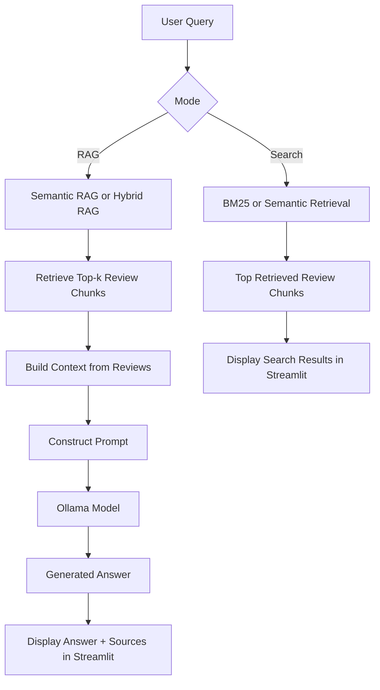

# Amazon Review Retrieval System: BM25 vs. Semantic Search

### DSCI 575: Milestone 1

## Project Overview

This project implements a Information Retrieval (IR) system using the **Amazon Reviews 2023 Dataset** appliances category. We compare keyword-based retrieval (**BM25**) with vector-based retrieval (**Semantic Search**)

BM25 - keyword-based retrieval using term frequency statistics
Semantic Search - vector-based retrieval using sentence embeddings and FAISS

Along with a Streamlit app which allows interactive querying

---

## Repository Structure

```
DSCI_575_project_tchu2001_wfrankel/
├── README.md                         # project overview, setup, usage, and app instructions
├── environment.yml                   # conda environment specification
├── .env                              # never commit secrets
├── app/
│   └── app.py                        
├── data/
│   ├── raw/
│   │   ├── merged.parquet
│   │   ├── meta_raw.parquet
│   │   ├── reviews_raw.parquet
│   │   └── stratified_sample.parquet
│   └── processed/
│       ├── chunks.parquet            # cleaned/chunked review corpus
│       ├── tokenized_corpus.pkl      # tokenized corpus BM25
│       ├── bm25_index.pkl            # retrieval index
│       ├── embeddings.npy            # embeddings
│       └── faiss.index               # FAISS vector index
├── notebooks/
│   ├── milestone1_exploration.ipynb  
│   └── milestone1_evaluation.ipynb   
├── results/
│   ├── milestone1_discussion.md      
│   ├── milestone2_discussion.md      # RAG Milestone 2 discussion
│   └── figures/
│       ├── query1_results.png
│       ├── query2_results.png
│       ├── query3_results.png
│       ├── query4_results.png
│       └── query5_results.png
└── src/
    ├── bm25.py                       
    ├── semantic.py                   
    ├── hybrid.py                     
    ├── rag_pipe.py                   
    ├── retrieval_metrics.py         
    └── utils.py                      
```

## Setup and installation instructions

### 1. Clone the Repository

```bash
git clone https://github.com/ubc-mds/DSCI_575_project_tchu2001_wfrankel.git
cd DSCI_575_project_tchu2001_wfrankel
```

### 2. Set up the environment using Conda  

```bash
conda env create -f environment.yml
conda activate 575_capstone
```

### 3. Configuration (.env)

Create a `.env` file in the root directory to manage environment variables so you dont commit secrets to GitHub publically.

```bash
touch .env
```

Add the downloaded Amazon product category files from the Amazon Reviews 2023 dataset and place them in data/raw/.

---

### Data

Data
Source: Amazon Reviews 2023 — Appliances category

Raw data is streamed directly from the dataset host via DuckDB (no full file download required). Reviews and metadata are joined and saved as compressed Parquet (ZSTD) to data/raw/.

Corpus: A stratified sample of 1,149 reviews drawn from merged.parquet (20,000 rows) across buckets of average_rating × review length (short/medium/long) × verified_purchase, with at most one review per product per stratum and 50 reviews per stratum. This ensures coverage across rating levels and review lengths while avoiding product duplication.

## EDA + Preprocessing

To regenerate the stratified sample, run the DuckDB sampling cells in notebooks/milestone1_exploration.ipynb

`notebooks/milestone1_exploration.ipynb`

EDA includes:

- an overview of the dataset (fields, size, example records)
- inspection of sample records
- selection and justification of fields for retrieval
- description of text preprocessing decisions

For EDA, we use a **small subset** and create a **stratified sample** saved in:
`data/raw/stratified_sample.parquet`

## BM25 Retrieval

`src/bm25.py`

Creates:

- `data/processed/chunks.parquet`
- `data/processed/tokenized_corpus.pkl`
- `data/processed/bm25_index.pkl`

Run:

```bash
python src/bm25.py
```

## Semantic Retrieval

`src/semantic.py`

Uses:

- `sentence-transformers` (all-MiniLM-L6-v2)
- `faiss` for vector search

Creates:

- `data/processed/embeddings.npy`
- `data/processed/faiss.index`

Run:

```bash
python src/semantic.py
```

## Qualitative Evaluation

We created a query set (10 queries), retrieved top-5 from BM25 and semantic search, and compare results for 5 selected queries. We summarize strengths, weaknesses, and failure cases. This can be found in `results/milestone1_discussion.md`

## Web App (Streamlit)

Features:

- Search mode selector: **BM25** or **Semantic**
- Query input box
- Top 3 results displayed with:
  - product title
  - truncated review text (~200 chars)
  - rating
  - retrieval score

Run the app:

```bash
streamlit run app/app.py
```

## RAG Pipeline (Milestone 2)

`src/rag_pipe.py`

The RAG pipeline combines semantic retrieval with an LLM (Ollama) to generate
grounded answers from Amazon review context.

### 1. Install Ollama

Download and install Ollama from <https://ollama.com/download>, then pull the model:

```bash
ollama pull llama3.2:3b
```

### 2. Start the Ollama server

Ollama must be running in the background whenever you use the RAG pipeline or app.
Open a different terminal and run:

```bash
ollama serve
```

Leave this terminal open.

### 3. Build retrieval indexes (if not already done)

```bash
python src/bm25.py
python src/semantic.py
```

### 4. Run the RAG pipeline

```bash
python src/rag_pipe.py
```

This will retrieve the top-5 most relevant reviews for a test query and generate
an answer using the LLM.

### Model choice

We use `llama3.2:3b` via Ollama for local inference. This model requires ~2GB of
disk space and runs on CPU without a GPU. It was chosen for its balance of response
quality and compatibility with laptop hardware.

## Workflow Diagram



## Web app (Streamlit) description

The Streamlit app supports two modes:

### Search
Search-only retrieval interface for Milestone 1:
- BM25 search
- Semantic search
- Top results displayed with:
  - product title
  - rating
  - retrieval score
  - truncated review text

### RAG
Retrieval-augmented generation interface for Milestone 2:
- Semantic RAG
- Hybrid RAG
- Generated answer displayed prominently above the retrieved sources
- Retrieved review documents shown below the answer with scores and metadata

## Contributors

- Tiffany Chu tchu2001
- Wendy Frankel wfrankel

---
