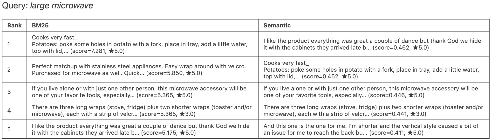
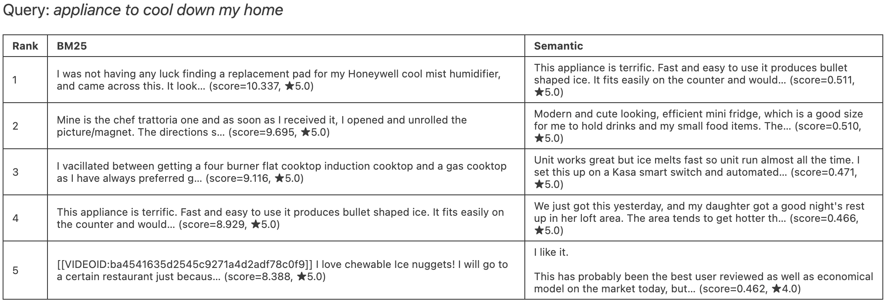
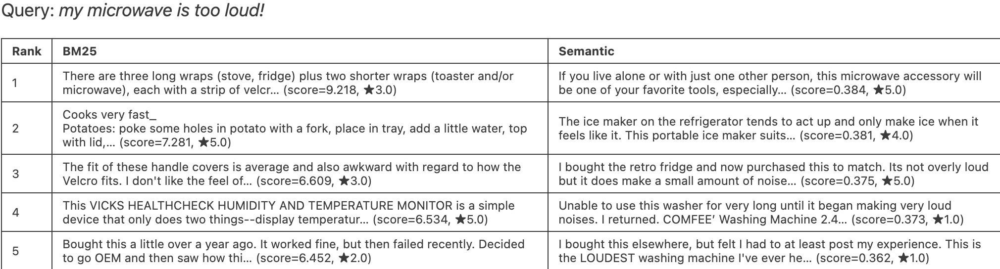
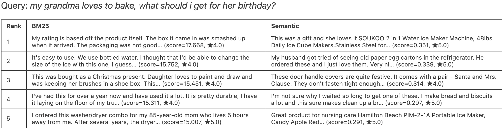
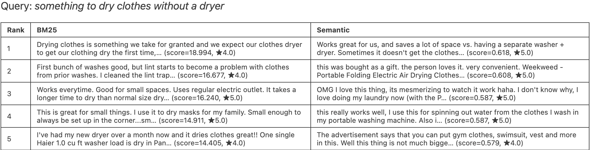

## Discussion

### 4.3 Compare Results

For the query, 'large microwave', neither method performed extremely well - both missed the aspect of 'large', and focused on other aspects as well. Some reviews were the same between methods. 

Both methods struggle because the intent implies “air conditioner” or “cooling appliance,” but the corpus is heavy on ice makers and fridges. BM25 returns keyword matches like humidifier pads, magnets, and cooktops which is mostly irrelevant. Semantic does a bit better by surfacing mini fridges and ice makers (cooling‑adjacent), but still misses direct “cool down my home” intent. So overall semantic slightly better, but still weak.

BM25 anchors on the word microwave and retrieves accessories or unrelated reviews mentioning microwave, but not noise issues. Semantic returns some appliance‑noise reviews (washer noise, fridge noise), which align with the too loud concept but not really microwave‑specific

This is a recommendation query and neither method is designed for intent‑based gifting. BM25 returns unrelated appliance reviews (ice maker, washer/dryer) due to generic words like “gift,” “mom,” etc. Semantic finds one baking‑related review (“bread and biscuits”), but most results are still off‑topic.

Both methods perform well because the intent directly applies to portable dryers or air‑drying devices. BM25 retrieves dryer‑related reviews with strong keyword overlap (high relevance). Semantic also retrieves relevant results, including compact washer/dryer combos and air‑drying devices even when wording differs

### 4.4 Summarize Insights

Summarize your overall findings:

What are the strengths and weaknesses of each method?
What types of queries are challenging for both methods?
Where might more advanced methods (e.g., RAG or reranking) help?

**Strengths**
- **BM25:** strong on keyword-heavy queries; fast and reliable when exact terms appear.
- **Semantic:** better at concept matching (e.g., dishwasher query) and paraphrased intent.

**Weaknesses**
- **BM25:** susceptible to keyword drift and irrelevant matches.
- **Semantic:** can miss specific keyword constraints and sometimes retrieves loosely related appliance reviews.

**Challenging Queries**
- Highly contextual or recommendation-style queries (e.g., gift ideas, “cool down my home”)

**Where advanced methods could help**
- Reranking (BM25 + semantic) for better precision
- RAG or intent classification to interpret complex needs and map to specific appliance categories